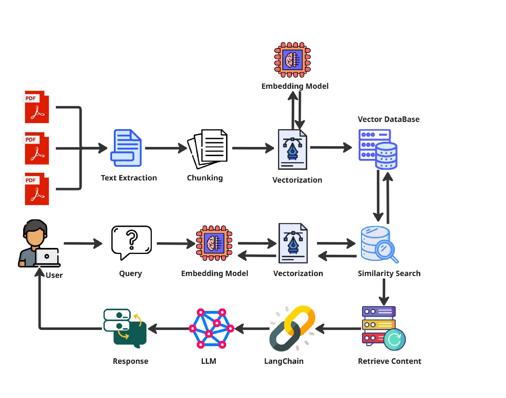
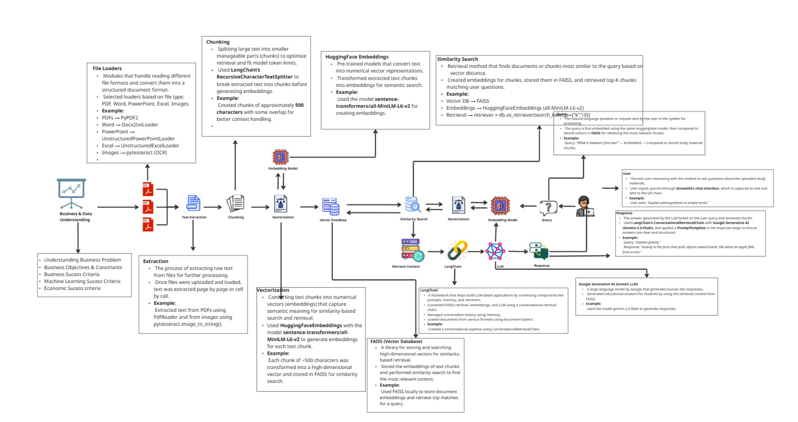

<div align="center">
  
  
  
  
  
</div>

<br />

<div align="center">
  <h1 align="center">EDUBOT – AI-Powered Multi-Agent Learning Assistant</h1>
  <p align="center"><strong>Learn Smarter, Not Harder!</strong></p>
</div>

## Table of Contents
- [Overview](#overview)
- [What I Built & How It Works](#what-i-built--how-it-works)
- [Supported File Types](#supported-file-types)
- [Tech Stack](#tech-stack)
- [Project Structure](#project-structure)
- [Prerequisites](#prerequisites)
- [Installation & Quick Start](#installation--quick-start)
- [Environment Variables](#environment-variables)
- [How It Works (Flow)](#how-it-works-flow)
- [Limitations & Known Issues](#limitations--known-issues)
- [Future Roadmap](#future-roadmap)
- [Impact](#impact)
- [Design Documents & References](#design-documents--references)
- [Screenshots](#screenshots)
- [Acknowledgements](#acknowledgements)

---

## Overview
EDUBOT is an AI-driven educational assistant built for K–12 students, designed to make learning interactive, personalized, and visually engaging. It combines Generative AI, Retrieval-Augmented Generation (RAG), and LangGraph-based agentic workflows to deliver context-aware academic support across subjects. Developed during training at 360DigiTMG and project tenure at AiSPRY (Aug–Sep 2025).


---

## What I Built & How It Works

EDUBOT follows a multi-agent architecture orchestrated by LangGraph, where each agent handles a specialized task:

- **Conversational Agent (EDUBOT Core):** Handles general academic queries with memory continuity, so the assistant remembers context across a conversation session.
- **Math Agent (SymPy + NumPy + Matplotlib):** Solves equations, computes derivatives and integrals symbolically using SymPy, and plots graphs using Matplotlib for step-by-step visual explanations.
- **Quiz Agent:** Dynamically generates MCQs and quizzes based on uploaded study material or topic input to test student understanding.
- **Image Generation Agent (Gemini 2.5 + Stable Diffusion XL):** Creates educational diagrams and illustrations on demand to support visual learning.
- **BLIP + EasyOCR Agent:** Extracts text from scanned documents and images using EasyOCR, and generates captions for visual content using BLIP.
- **RAG + FAISS Agent:** Handles document ingestion, generates embeddings using HuggingFace MiniLM-L6-v2, stores them in a FAISS vector database, and retrieves relevant context for LLM responses.
- **Watcher Agent:** Monitors a designated folder and auto-detects newly added files, triggering automatic re-ingestion and knowledge base updates without manual intervention.
- **Evaluation Agent:** Continuously monitors response quality using BLEU, ROUGE, and semantic similarity metrics to ensure output accuracy.

---

## Supported File Types
Students can upload their own study materials to personalize the AI's knowledge base. EDUBOT supports:
- **Documents:** `.pdf`, `.txt`, `.doc`, `.docx`
- **Presentations:** `.ppt`, `.pptx`
- **Spreadsheets:** `.xls`, `.xlsx`
- **Images (OCR & Captioning):** `.jpg`, `.jpeg`, `.png`

---

## Tech Stack

| Category | Tools |
|---|---|
| **Orchestration** | LangGraph, LangChain |
| **LLMs** | Google Gemini 2.5 Flash |
| **Image Generation** | Stable Diffusion XL |
| **Vision & OCR** | BLIP, EasyOCR |
| **RAG & Vector Store** | FAISS, HuggingFace MiniLM-L6-v2 |
| **Math Engine** | SymPy, NumPy, Matplotlib |
| **Frontend** | Streamlit |
| **Language** | Python 3.11+ |
| **Evaluation** | BLEU, ROUGE, Semantic Similarity |

---

## Project Structure

```text
EDUBOT/
├── agentic_app.py         # Main Streamlit Application UI
├── Agentic_Bot.py         # Core Agentic Logic & LangGraph Orchestration
├── Agentic_injest.py      # Watcher & RAG Ingestion Pipeline
├── requirements.txt       # Project Dependencies
├── .env                   # Environment Variables (Keys)
├── Data/                  # Uploaded Study Materials & Documents
├── vectorstore/           # FAISS Vector Database Storage
├── Outputs/               # Interface Screenshots & System Diagrams
└── README.md              # Project Documentation
```

---

## Prerequisites
Before running EDUBOT, ensure you have the following installed:
- **Python:** Version `3.10` or higher.
- **CUDA / GPU (Optional but Recommended):** Running Stable Diffusion XL and local BLIP models is computationally heavy. A CUDA-enabled GPU will drastically improve processing speed.
- **API Keys:** You will need a Google Gemini API key and a HuggingFace token.

---

## Installation & Quick Start

1. **Clone the repository:**
   ```bash
   git clone https://github.com/your-username/EDUBOT.git
   cd EDUBOT
   ```

2. **Create and activate a virtual environment (Optional but recommended):**
   ```bash
   python -m venv venv
   source venv/bin/activate  # On Windows use: venv\Scripts\activate
   ```

3. **Install dependencies:**
   ```bash
   pip install -r requirements.txt
   ```

4. **Set up environment variables:**
   Create a `.env` file in the root directory (see [Environment Variables](#environment-variables)).

5. **Run the Streamlit app:**
   ```bash
   streamlit run agentic_app.py
   ```

---

## Environment Variables

Create a `.env` file in the root directory and add the following keys:

```env
# Google Gemini API Key for LLM & Image Generation
GOOGLE_API_KEY=your_gemini_api_key_here

# HuggingFace Token for Stable Diffusion XL & MiniLM Embeddings
HUGGINGFACE_TOKEN=your_huggingface_token_here
```

---

## How It Works (Flow)

1. **Input:** Student enters a query or uploads a file via the Streamlit UI.
2. **Routing:** LangGraph orchestrator identifies the intent and routes to the right agent.
3. **Execution:**
   - If document-based — RAG + FAISS agent retrieves relevant context from the knowledge base.
   - If math — SymPy solves and Matplotlib plots the result.
   - If image needed — Stable Diffusion XL or Gemini 2.5 generates it.
   - If new files are added — Watcher agent auto-updates the knowledge base.
4. **Evaluation:** Evaluation agent scores each response using BLEU & ROUGE in the background.
5. **Output:** The final response is rendered back to the student in the Streamlit chat interface.

---

## Limitations & Known Issues
- **Hardware Requirements:** Running Stable Diffusion XL and local vision models (BLIP) requires significant VRAM. Without a dedicated GPU, image generation and OCR tasks may be slow.
- **OCR Accuracy:** EasyOCR may struggle with handwritten notes or heavily distorted document scans.

---

## Future Roadmap
- 🎙️ **Voice Input Support:** Allow students to talk to EDUBOT seamlessly.
- 📈 **Student Progress Tracking:** Dashboard to track quiz scores and topic mastery over time.
- 🌍 **Multi-language Support:** Expand the tutor to teach subjects in regional languages.
- 📱 **Mobile UI Optimization:** Build a fully responsive web/mobile app layout.

---

## Impact
EDUBOT merges reasoning, vision, and language into a single AI tutor — enabling interactive, visually rich, and context-aware learning that adapts to each student's needs across subjects.

---

## Design Documents & References

### High-Level Design (HLD)


### Low-Level Design (LLD)


---

## Screenshots
<div align="center">
  
  
  
  
  
  
</div>

<div align="center">

## 🚀 Built with Agentic AI, Generative AI, RAG, and a passion for making education smarter

</div>
